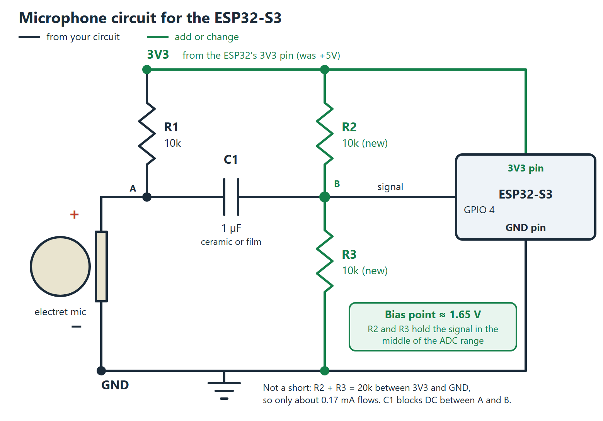
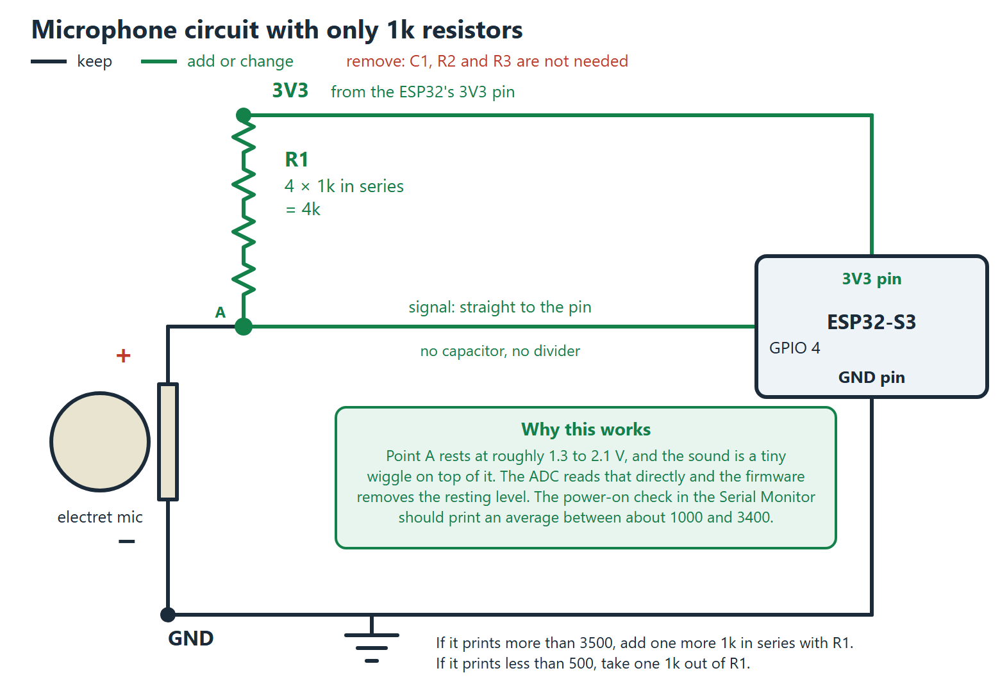

# BandFlow wristband wiring

Pins are set at the top of `bandflow_esp32.ino`. The ESP32-S3 runs on 3.3 V, so nothing connected to a
pin may go above 3.3 V.

| Part | Pin | Setting |
| --- | --- | --- |
| Display (SPI) | 10 CS, 11 DC, 12 SCK, 13 MOSI, 1 reset, 38 backlight | fixed |
| Touch panel (I2C) | 9 SDA, 46 SCL, 8 interrupt, 3 reset | in `touch.h` |
| Vibration motor | 16 | `VIBRATION_PIN` |
| Microphone signal | 7 | `MIC_PIN` |

## Microphone

The microphone output **cannot go to GPIO 45**. That pin has no analog input, and it is also read when the chip
boots. The ADC works on GPIO 1 to 10 only. Display and touch already use 1, 3, 8, 9 and 10, so use **2, 4, 5, 6
or 7** and set `MIC_PIN` to match. The sketch uses **GPIO 7**.

### The circuit you built (the one the sketch is set up for)

This is the circuit from your Uno test with R1 = 1k, wired to GPIO 7:

```
3V3 (or 5V) ──[ R1 = 1k ]──┬── electret (+)
                            │
                            └──[ C1 = 1 µF ]── GPIO 7 (MIC_PIN)
electret (−) ── GND
GND ── ESP32 GND
```

- **C1 orientation.** With R1 = 1k the microphone side of C1 sits at a higher voltage than the pin side, so the
  "+" leg of an electrolytic capacitor goes towards the microphone, exactly as in your original picture.
- **3V3 or 5V for R1.** 3V3 is safer, because the capacitor is then the only thing between 5 V and the pin and a
  failed capacitor could not hurt the chip. It is one wire to move. 5V should also work: R1 limits the surge when
  C1 charges at power-on to a few milliamps.
- **No bias resistors are needed.** A capacitor on its own gives the signal no resting voltage, which is what the
  two extra resistors in the options below are for. The sketch does it in software instead: it switches on the
  chip's own pull-up and pull-down resistors (about 45k each) on the pin, which together hold it near half the
  supply (`MIC_SOFT_BIAS` in the sketch). It also reads the ADC four times for every sound sample and averages
  them, as your Arduino sketch did, which lowers the noise.

The power-on check (see "Checking the wiring") tells you whether the built-in bias took effect. If it did not,
add two equal resistors, 1k is fine: one from 3V3 to the GPIO 7 side of C1 and one from there to GND. They cost
battery but they work, and nothing else changes.

The two circuits below are alternatives. You only need them if the circuit above does not give a good signal.

### Alternative A: 10k and 4.7k resistors (best signal)



Source: [mic-circuit.svg](mic-circuit.svg). R1 should be 4.7k (10k also works), R2 = R3 = 10k, and the pin is whichever you set as `MIC_PIN`. The pictures in this section show GPIO 4.

1. **Add R2 and R3.** The capacitor passes only the changing part of the sound, so without them the ADC
   input has no resting voltage and half of every sound wave is lost. Two equal resistors hold it at about
   1.65 V, comfortably inside the ADC's range.
2. **Use a non-polarized C1** (a 1 µF ceramic or film capacitor). With the bias resistors the ESP32 side of C1
   sits at about 1.65 V, which is probably *higher* than the microphone side (about 1 V), so an electrolytic
   capacitor would be reverse biased. If an electrolytic is all you have, measure the DC voltage at A and at B
   with a multimeter and put the "+" leg on whichever is higher.

This is not a short circuit: R2 and R3 are 20k in series between 3V3 and GND, so only about 0.17 mA flows
through them, and C1 blocks DC between the microphone side (A) and the signal side (B).

### Alternative B: no capacitor, only 1k resistors



Source: [mic-circuit-1k.svg](mic-circuit-1k.svg). Do not use 1k for R2 and R3. Two 1k resistors across 3.3 V waste
1.65 mA all the time (a wristband battery notices) and drain the sound signal away. You do not need them: the
resting level is only there for the capacitor, and without the capacitor the ADC can read the microphone's own
DC level directly. The firmware removes that level in software.

- **R1 is four 1k resistors in series (4k).** A bigger R1 gives a stronger signal, up to the point where the
  microphone's resting voltage gets too close to the top of the ADC range.
- **No C1, no R2, no R3.** Point A goes straight to the GPIO pin.
- On this chip the ADC is accurate to roughly 2.5 V, so point A has to rest below that. That depends on the
  capsule, so check it with the power-on message below and adjust R1 by one resistor at a time.

### Checking the wiring

When the watch powers on, the Serial Monitor (115200) prints a check such as:

```
Microphone check on GPIO 7: average 2650 of 4095, quiet noise swing 9 counts
  -> the DC level looks right
```

| Average | Meaning |
| --- | --- |
| below 300 | The microphone is not connected or not powered, or the built-in bias did not take effect. Check the wires, then add the two 1k resistors described above. |
| 1000 to 3400 | Good. |
| above 3500 | Too close to the top of the ADC range, so loud sounds would clip. Check the wiring. Without a capacitor (alternative B), add one more 1k to R1. |

### If the sound is too faint

A bare electret capsule gives only a few millivolts, which a 12-bit ADC barely sees. When you record, the Serial
Monitor prints `speech peak N counts (needs 8)`. If the watch keeps saying "I can't hear you" even when you speak
close to it, the signal is too weak and the fix is more gain, not a different resistor. The number to watch is
that peak: a few counts means silence, 30 or more is a healthy recording. A ready-made microphone
amplifier board such as the MAX4466 replaces the capsule and all of the resistors and the capacitor: power it
from 3.3 V and connect its OUT pin to `MIC_PIN`.

## Vibration motor

Never connect a motor straight to a GPIO pin. It draws far more current than the pin is allowed to supply and can
damage the chip. Switch it with a transistor:

```
GPIO 16 ──[ 1k ]── base of an NPN transistor (2N2222 or BC547)
emitter ── GND
collector ── motor (−)
motor (+) ── 3.3 V (or 5 V, whichever the motor is rated for)
diode (1N4148 or 1N4007) across the motor: stripe towards motor (+)
```

A vibration motor module that already has a driver on it can be connected directly: signal to GPIO 16, power and
ground as marked. If your driver turns the motor on when the pin goes low, change `VIBRATION_ACTIVE_LEVEL` to
`LOW`.

The watch buzzes once at power-on (a quick wiring test), for 0.35 s when a new step arrives, and with a short
double pulse when you tap DONE.
